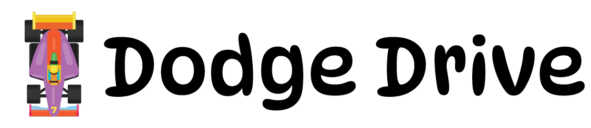
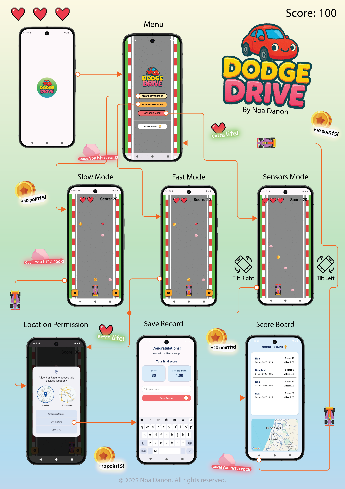

  

**'DodgeDrive'** is a simple Android game app developed as part of the **Mobile Application Development** course in a Bachelor's degree in Computer Science.

The game challenges the player to avoid falling rocks by controlling a car across three lanes. The player starts with three lives, which are visually represented as hearts. The game ends after three collisions.

  

# 🕹️ Dodge Drive – Part 2 Update Overview

This update introduces several key gameplay enhancements and features:

---

## 🎮 Gameplay Modes

### 1. Slow Mode  
Obstacles fall at a relaxed pace – ideal for beginners or a casual experience.

### 2. Fast Mode  
A challenging mode with high-speed obstacles for experienced players seeking intense action.

### 3. Sensor Mode  
Control the car by tilting your device **left** or **right**. Movement is responsive to your device's orientation.

---

## 🛣️ Expanded Game Board

- The game grid now includes **5 lanes** instead of 3.
- This provides more space and complexity for dodging obstacles and collecting coins.

---

## 🏆 Scoreboard & Record Location

- After each game, the result is saved with the following details:
  - 👤 **Player name**
  - 🪙 **Final score**
  - 📍 **GPS location** where the score was set
  - 📅 **Date** of the achievement

- The **Top 10 high scores** are saved persistently.

- Players can:
  - 🗂️ **Sort scores** by score or distance
  - 🗺️ **View scores on a map** to see where records were made

---

## 🛠️ Technologies Used

- **Language:** Kotlin  
- **IDE:** Android Studio  
- **UI:** XML Layouts with Material Components  
- **Architecture:** MVVM-inspired logic separation  
- **Feedback:** Vibration & Toast APIs  
- **Version Control:** Git & GitHub  

## Installation and usage
Included in the repo is an [APK file](https://github.com/noadanon220/DodgeDrive/blob/main/com.danono.dodgedrive.apk) of the app. feel free to install it or build the code yourselves

## 🖼️ Screenshots

  <video src="https://github.com/user-attachments/assets/1cfd9886-8e4a-4806-beda-5e991bcef17a" alt="DodgeDrive Demo" ></video>

---

Feel free to clone the repo and try the game on your Android device!
