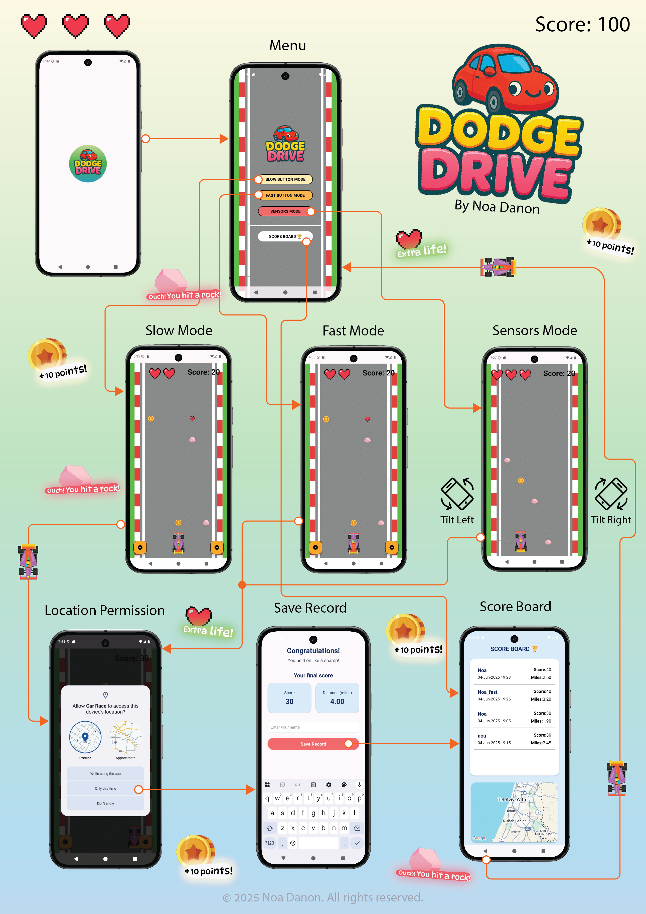

<div align="center">
  
</div>

**'DodgeDrive'** is a simple Android game app developed as part of the **Mobile Application Development** course in a Bachelor's degree in Computer Science.

The game challenges the player to avoid falling rocks by controlling a car across **five lanes**.  
Players can **collect coins** to increase their score and **gather hearts** to gain extra lives.  
Each game starts with **three lives**, visually represented as ❤️ icons.  
The game ends after three collisions, unless extra hearts are collected along the way.

Before starting, players can **choose between three gameplay modes**:
- 🐢 **Slow Mode** – Relaxed obstacle speed for casual play  
- ⚡ **Fast Mode** – High-speed, more challenging experience  
- 🎮 **Sensor Mode** – Control the car by tilting the device left/right

<div align="center">
  
</div>

# 🕹️ Dodge Drive – Part 2 Update Overview

This update introduces several key gameplay enhancements and features:

---

## 🎮 Gameplay Modes

### 1. Slow Mode  
Obstacles fall at a relaxed pace – ideal for beginners or a casual experience.

### 2. Fast Mode  
A challenging mode with high-speed obstacles for experienced players seeking intense action.

### 3. Sensor Mode  
Control the car by tilting your device **left** or **right**. Movement is responsive to your device's orientation.

---

## 🛣️ Expanded Game Board

- The game grid now includes **5 lanes** instead of 3.
- This provides more space and complexity for dodging obstacles and collecting coins.

---

## 🪙 Coins, Extra Lives & Background Music

- 🪙 **Coins** collected during the game add **10 points** each to the final score.
- ❤️ **Extra lives** can also appear on the board – collecting them increases the player's remaining lives.
- 💥 Collisions reduce the player's life count.
- Players begin with **3 lives** (represented by hearts) and the game ends when all lives are lost.
- 🎵 A **background soundtrack** was added to enhance the gameplay experience.

---

## 🏆 Scoreboard & Record Location

- After each game, the result is saved with the following details:
  - 👤 **Player name**
  - 🪙 **Final score**
  - 📍 **GPS location** where the score was set
  - 📅 **Date** of the achievement

- The **Top 10 high scores** are saved persistently.

- Players can **View scores on a map** to see where records were made

---

## 🛠️ Technologies Used

- **Kotlin** – Main programming language
- **Android SDK** – Core framework for Android development
- **ViewBinding** – Efficient access to views
- **Fragments & Activities** – Structured navigation and UI flow
- **RecyclerView** – Dynamic display of the scoreboard
- **SharedPreferences** – Persistent local storage for top 10 scores
- **Google Maps SDK** – To show where each high score was achieved
- **SensorManager** – Enables motion-based control in Sensor Mode
- **MediaPlayer** – Background music and sound effects (coin, rock, extra life)
- **Custom Drawables & XML Styling** – Rounded cards, shadows, and game visuals
- **Gradle** – Build and dependency management

---

## 📲 Installation

Feel free to clone and run the app on any Android device or emulator:

```bash
git clone https://github.com/noadanon220/DodgeDrive.git


