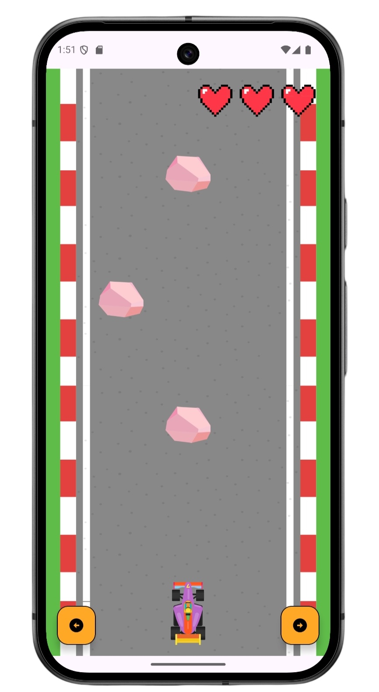
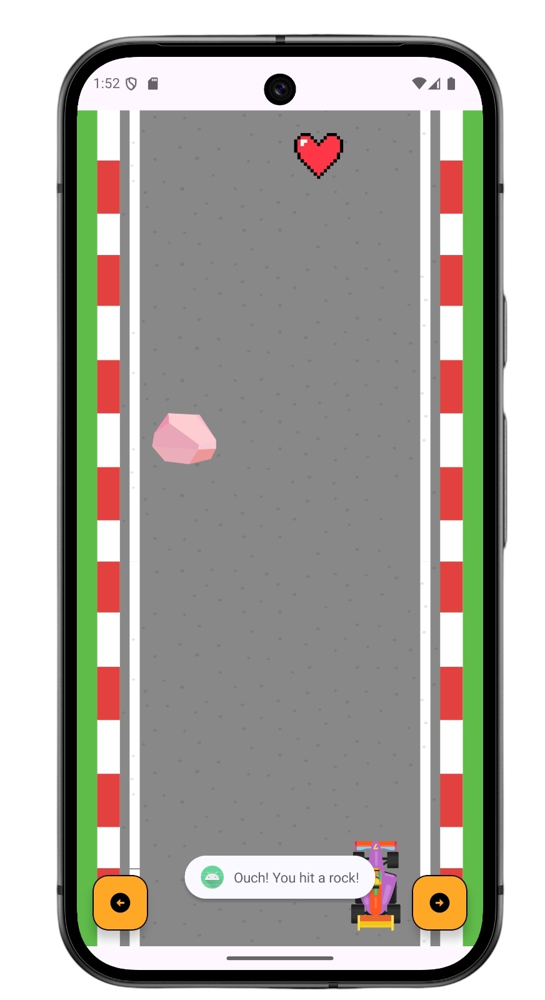
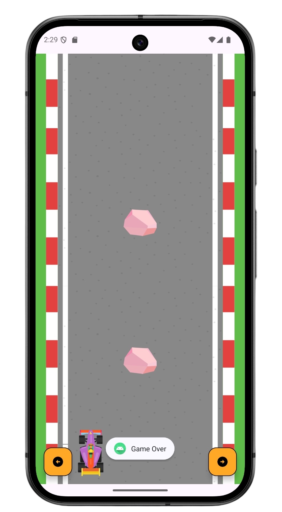

#  DodgeDrive

**DodgeDrive** is a simple Android game app developed as part of the **Mobile Application Development** course in a Bachelor's degree in Computer Science.

The game challenges the player to avoid falling rocks by controlling a car across three lanes. The player starts with three lives, which are visually represented as hearts. The game ends after three collisions.

## 🎮 Gameplay

- Tap the left or right button to move the car between lanes.
- Rocks fall from the top of the screen in random columns.
- If a rock hits the car, the player loses a life.
- Vibration and Toast messages provide feedback after each collision.
- The game stops automatically after all lives are lost.

## 🛠️ Technologies Used

- **Language:** Kotlin  
- **IDE:** Android Studio  
- **UI:** XML Layouts with Material Components  
- **Architecture:** MVVM-inspired logic separation  
- **Feedback:** Vibration & Toast APIs  
- **Version Control:** Git & GitHub  

## 🖼️ Screenshots

  
  
  

---

Feel free to clone the repo and try the game on your Android device!
